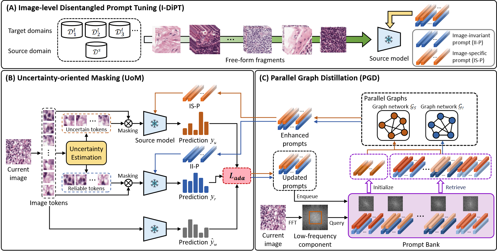

# F2TTA

Code for the paper **"F^2TTA: Free-Form Test-Time Adaptation on Cross-Domain Medical Image Classification via Image-Level Disentangled Prompt Tuning"**. This paper has been submitted to related journals, and we will release the code after the review process.

# Abstract 

Test-Time Adaptation (TTA) has emerged as a promising solution for adapting a source model to unseen medical sites using unlabeled test data, due to the high cost of data annotation. Existing TTA methods consider scenarios where data from one or multiple domains arrives in complete domain units. However, in clinical practice, data usually arrives in domain fragments of arbitrary lengths and in random arrival orders, due to resource constraints and patient variability. This paper investigates a practical Free-Form Test-Time Adaptation (F$^{2}$TTA) task, where a source model is adapted to such free-form domain fragments, with shifts occurring between fragments unpredictably.
In this setting, these shifts could distort the adaptation process. To address this problem, we propose a novel Image-level Disentangled Prompt Tuning (I-DiPT) framework. I-DiPT employs an image-invariant prompt to explore domain-invariant representations for mitigating the unpredictable shifts, and an image-specific prompt to adapt the source model to each test image from the incoming fragments. The prompts may suffer from insufficient knowledge representation since only one image is available for training. To overcome this limitation, we first introduce Uncertainty-oriented Masking (UoM), which encourages the prompts to extract sufficient information from the incoming image via masked consistency learning driven by the uncertainty of the source model representations. Then, we further propose a Parallel Graph Distillation (PGD) method that reuses knowledge from historical image-specific and image-invariant prompts through parallel graph networks. Experiments on breast cancer and glaucoma classification demonstrate the superiority of our method over existing TTA approaches in F$^{2}$TTA.

